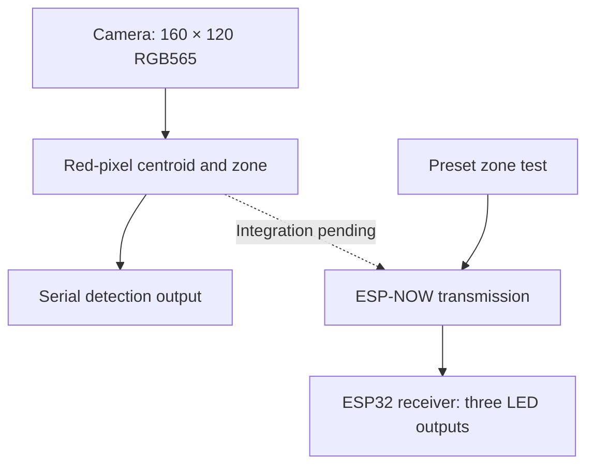

# Adaptive LED Headlight Prototype

A C++ / Arduino prototype exploring three-zone selective lighting with an ESP32 camera module and a separate ESP32 LED controller. A red marker represents a target in the camera view; the receiver switches off the LED assigned to the target's zone.

The project separates image processing from lighting control and uses ESP-NOW for wireless zone messages.

## Current implementation

This repository contains three development sketches:

| Sketch | Implemented behaviour |
| --- | --- |
| [Camera marker detection](esp32cam_marker_detection/esp32cam_marker_detection.ino) | Captures RGB565 images, identifies red pixels, computes their centroid and prints a left/centre/right zone over serial |
| [Wireless sender test](esp32cam_sender_test/esp32cam_sender_test.ino) | Sends preset left, centre, right and no-target messages at two-second intervals |
| [LED receiver](esp32_receiver_led_controller/esp32_receiver_led_controller.ino) | Receives ESP-NOW messages and controls three LED outputs |

**Integration status:** the committed camera sketch does not transmit detection results. The sender test uses synthetic inputs. Combining camera detection with wireless transmission is the next integration step; a complete camera-driven lighting demonstration is not yet documented here.

The current output is three digital LED channels. PWM dimming, a matrix driver, automatic vehicle recognition and automotive operation are outside the implemented scope.

## Architecture



## Detection algorithm

The camera sketch examines all pixels in a 160 × 120 frame. It expands the RGB565 channels to approximate 8-bit values and considers a pixel red when:

```cpp
(r > 180) && (r > g + 50) && (r > b + 50)
```

More than 100 qualifying pixels are required. The mean horizontal position of those pixels determines the zone:

| Zone value | Image position |
| --- | --- |
| 0 | No target in the message protocol |
| 1 | Left third |
| 2 | Centre third |
| 3 | Right third |

The algorithm combines all qualifying pixels into one centroid; it does not track separate objects. Lighting, reflections and multiple red objects can affect classification. The camera loop includes a 250 ms delay, so this delay should not be presented as a measured frame rate or end-to-end latency.

## Hardware and output mapping

- Camera-capable ESP32 board with PSRAM and a compatible camera.
- Separate ESP32 receiver with GPIO 25, 26 and 27 available.
- Three low-current indicator LEDs, each with a suitable series resistor.
- Breadboard/jumper wiring, appropriate board power supplies and USB programming connections.

The camera configuration currently selects **CAMERA_MODEL_ESP32S3_EYE** in [board_config.h](esp32cam_marker_detection/board_config.h). Confirm the actual board and pin mapping before flashing; the folder name does not imply an AI-Thinker ESP32-CAM configuration.

| Receiver signal | GPIO | Firmware behaviour |
| --- | --- | --- |
| Left LED | 25 | LOW for a detected left-zone target |
| Centre LED | 26 | LOW for a detected centre-zone target |
| Right LED | 27 | LOW for a detected right-zone target |

For active-high indicator LEDs, connect each GPIO through a series resistor and LED to receiver ground. All three outputs start HIGH. A valid detected zone pulls its corresponding output LOW; a no-target message returns all outputs HIGH. GPIO outputs are intended for the indicator prototype, not direct connection to high-power lamps.

## Getting started

### 1. Configure the development environment

The repository contains standalone Arduino C++ sketches. Open each sketch in its matching folder using an ESP32-capable Arduino environment. Keep the camera headers beside the camera sketch.

A PlatformIO project configuration and the exact tested board/core versions have not yet been committed. Record those settings from the working local environment before claiming a reproducible build. The receiver uses the ESP-NOW receive callback with an `esp_now_recv_info_t` argument; the installed ESP32 core must support that signature.

Serial output uses **115200 baud** for all sketches.

### 2. Bring up the receiver

1. Connect the three indicator LEDs using the GPIO mapping above.
2. Flash `esp32_receiver_led_controller.ino` to the receiver.
3. Open its serial monitor and record the printed **Receiver STA MAC**.
4. Confirm the three LEDs initially illuminate with active-high wiring.

### 3. Check wireless LED control

1. Set `receiverMac[]` in `esp32cam_sender_test.ino` to the receiver's STA MAC.
2. Flash the sender test to the second board.
3. Ensure both boards operate on the same Wi-Fi channel. The sender's peer channel is set to 0, which uses its current channel; the sketches do not explicitly coordinate channels.
4. Observe left off, centre off, right off, then all on, each held for approximately two seconds.
5. Use the receiver's log to confirm receipt. An `ESP_OK` return from `esp_now_send` alone does not prove receiver delivery.

### 4. Check camera classification

1. Confirm the selected camera model, pin mapping and PSRAM settings.
2. Flash `esp32cam_marker_detection.ino` to the camera board.
3. Move a red marker through the camera's left, centre and right thirds.
4. Observe the reported pixel count, centroid and zone at 115200 baud.
5. Remove the marker and confirm the no-target output.

Flashing the camera sketch replaces the sender test on that board. In the current repository, these are separate tests.

## Message format and limitations

The sender and receiver share this structure:

```cpp
typedef struct DetectionData {
  bool carDetected;
  int zone;  // 0 = none, 1 = left, 2 = centre, 3 = right
} DetectionData;
```

Despite the field name `carDetected`, the test messages represent a target; the camera algorithm recognises red pixels rather than vehicles.

The structure is sent as raw bytes, so matching layout on both builds is required. The current receiver copies the payload without checking its length and does not validate the sender or zone. ESP-NOW encryption is disabled in the sender test.

The receiver also has no communication timeout: if messages stop, it retains the last LED state. A defined fallback state, payload validation and delivery monitoring are planned improvements, not completed features.

## Validation and next steps

See the [bench test checklist](docs/TEST_PLAN.md) for expected behaviour and a results template. No measured latency, range, accuracy or reliability figures are claimed.

1. Upload or implement the combined camera-to-ESP-NOW sender.
2. Record exact board models, ESP32 core version, PSRAM settings and build configuration.
3. Add packet-length/zone validation and a documented communication-loss policy.
4. Record a short demonstration of left/centre/right/no-target operation.
5. Measure response timing and repeat classification under different lighting.

This is a bench prototype inspired by selective headlight control. It has not been validated for road use.
